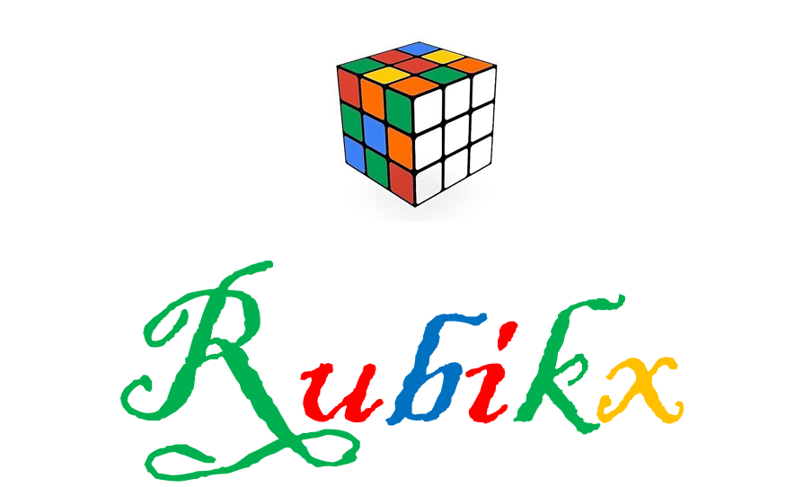

[CopyrightLicense]:./license.md

    A Complete Rubiks Game Suit and Solver!!!

	Final Course Project for COE 455-Computer Graphics-at Kwame Nkrumah University of Science and Technology

<!------------------------------------------Features----------------------------------------------------->
<h2>Features</h2>

  <ul>
    <li>Step by step tutorial for newbies on how to solve the cube</li>
    <li>Solves scrambled cubes providing step by step solution</li>
    <li>Input your cube via camera or still images</li>
    <li>Compete with friends or complete strangers online</li>
    <li>Timed practice and feedback</li>
  </ul>
 

